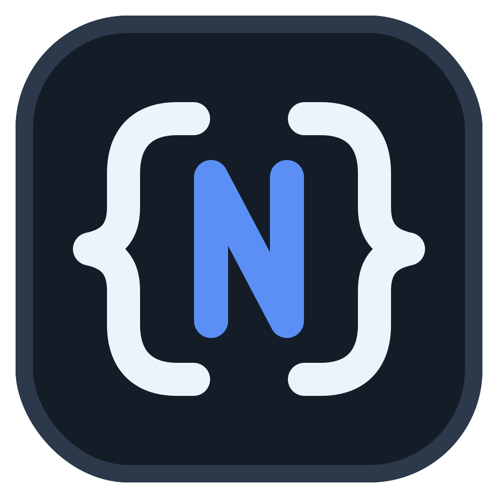
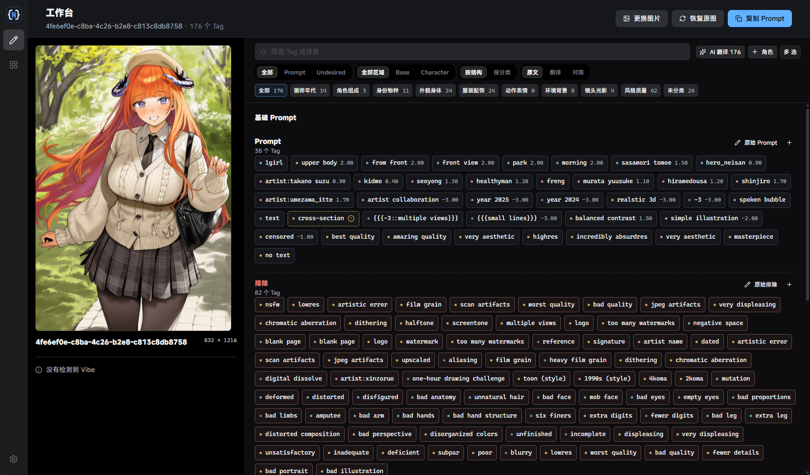
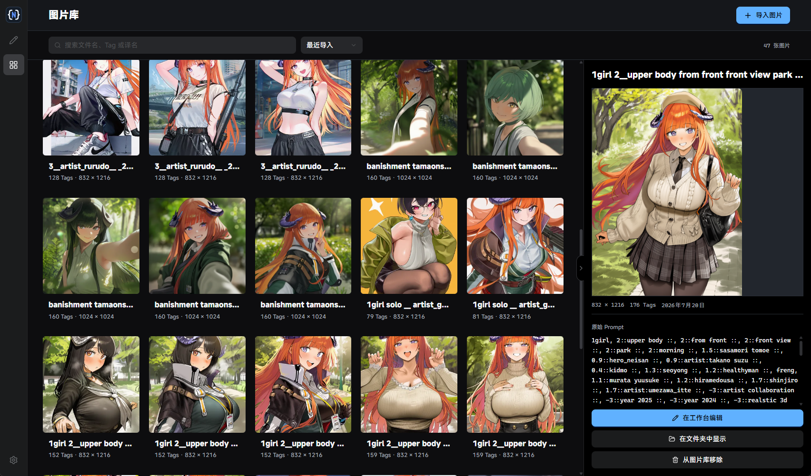

<div align="center">
  

  <h1>NovelAI Prompt Studio</h1>

  <p><strong>把 NovelAI 图片里的 Prompt，变成真正好用的可视化工作流。</strong></p>
  <p>本地优先的 NovelAI Diffusion V4 / V4.5 Prompt 编辑工作台与图片库。</p>

  <p>
    <a href="https://github.com/LBEILC/NovelAIPromptStudio/releases/latest"></a>
    <a href="https://github.com/LBEILC/NovelAIPromptStudio/actions/workflows/release.yml"></a>
    
    
  </p>

  <p>
    <a href="https://github.com/LBEILC/NovelAIPromptStudio/releases/latest"><strong>下载最新版</strong></a>
    ·
    <a href="#快速开始">快速开始</a>
    ·
    <a href="#参与开发">参与开发</a>
  </p>
</div>

---

## 不再被一整段 Prompt 淹没

NovelAI Prompt Studio 可以直接读取图片中的生成信息，把 Base Prompt、Character Prompt 和 Undesired Content 拆解成清晰的 Tag。你可以按区域、分类和关键词筛选，调整权重与顺序，编辑原始文本，再一键复制需要的 Prompt。



### 为 Prompt 编辑而设计

- **结构化拆解**：识别 Base / Character Prompt 与 Undesired Content，保留权重、顺序和原始语法。
- **高效整理**：搜索、分类筛选、拖拽排序、多选操作、批量添加与删除，一屏处理上百个 Tag。
- **AI 辅助理解**：通过你自己的 OpenAI-compatible 服务翻译并分类 Tag，结果缓存在本地，可继续手动修正。
- **所见即所得地复制**：复制完整 Prompt，或只复制当前筛选出的内容。
- **Vibe 信息可见**：只读解析图片内嵌的 Vibe 信息，并可定位导出的 Vibe 文件。
- **随时回到起点**：编辑草稿自动保留，也可以一键恢复到原图中的 Prompt。

## 让生成记录变成可检索的图片库

批量导入散落的生成图片或 NovelAI 导出 ZIP，按文件名、Tag 或译名搜索。选中图片即可查看尺寸、日期、完整 Prompt，并直接送入工作台继续编辑。



- 支持拖放或选择 `PNG`、`JPG`、`JPEG`、`WEBP`，图片库还支持批量导入 `ZIP`。
- 按内容识别重复图片，避免图库越整理越乱。
- 自动生成缩略图，提供网格浏览、排序、详情预览和原始 Prompt 查看。
- 从图片库移除项目时，不会删除最初导入的源文件。

## 本地优先，原图优先

你的图片、Prompt、Tag 字典和设置都保存在本机。工作台以只读方式打开源图，不会覆盖图片，也不会改写原始 metadata；只有主动导入图片库时，应用才会保存独立副本与缩略图。

AI 功能完全可选。启用翻译或分类时，只有相关 Tag 文本会发送到你配置的 OpenAI-compatible API；API Key 通过操作系统安全存储加密，前端页面无法读取明文。

## 快速开始

1. 前往 [Releases](https://github.com/LBEILC/NovelAIPromptStudio/releases/latest) 下载适合系统的安装包。
2. 启动应用，将一张 NovelAI 图片拖入工作台。
3. 筛选、翻译、分类或调整 Tag，然后点击 **复制 Prompt**。

| 平台 | 安装包 |
| --- | --- |
| Windows x64 | `NovelAI-Prompt-Studio-*-Windows-x64.exe` |
| macOS Apple Silicon | `NovelAI-Prompt-Studio-*-macOS-arm64.dmg` |
| macOS Intel | `NovelAI-Prompt-Studio-*-macOS-x64.dmg` |

> [!NOTE]
> 当前安装包尚未进行代码签名，Windows 或 macOS 可能显示安全提示。请只从本仓库的 Releases 页面下载。

如果图片不包含可识别的 NovelAI metadata，仍可在应用中查看图片，但不会自动获得完整的 Prompt 信息。应用主要面向 NovelAI Diffusion V4 / V4.5 图片。

## 你可能关心

<details>
<summary><strong>会修改我的原图吗？</strong></summary>

不会。工作台只读取源图；图片库保存的是独立副本。从图片库移除项目也不会删除原始文件。
</details>

<details>
<summary><strong>必须配置 AI 服务才能使用吗？</strong></summary>

不需要。Prompt 解析、筛选、编辑、复制和图片库都可以独立使用。AI 服务仅用于可选的 Tag 翻译与分类。
</details>

<details>
<summary><strong>数据保存在哪里？</strong></summary>

数据写入 Electron 的系统 `userData` 目录。数据库位于 `data/studio.sqlite`，图片库副本和缩略图位于 `assets/`。资源库位置可在设置中迁移。
</details>

<details>
<summary><strong>这是 NovelAI 官方应用吗？</strong></summary>

不是。本项目是面向 NovelAI 工作流的第三方工具，与 NovelAI 或 Anlatan 没有隶属或背书关系。
</details>

## 参与开发

需要 [Node.js 22](https://nodejs.org/) 及 npm。

```bash
git clone https://github.com/LBEILC/NovelAIPromptStudio.git
cd NovelAIPromptStudio
npm ci
npm run dev
```

常用命令：

```bash
npm test          # 运行测试
npm run build     # 构建前端
npm run package   # 生成当前平台安装包
```

Windows 与 macOS 是一等支持平台，并尽量保持 Linux 兼容。提交改动前请运行测试和生产构建；涉及窗口、快捷键、文件对话框、安全存储或打包的改动，还需要在对应操作系统上验证。

欢迎通过 [Issues](https://github.com/LBEILC/NovelAIPromptStudio/issues) 反馈问题或提出建议。

---

<div align="center">
  <sub>让 Prompt 回到创作流程里，而不是困在 metadata 里。</sub>
</div>
