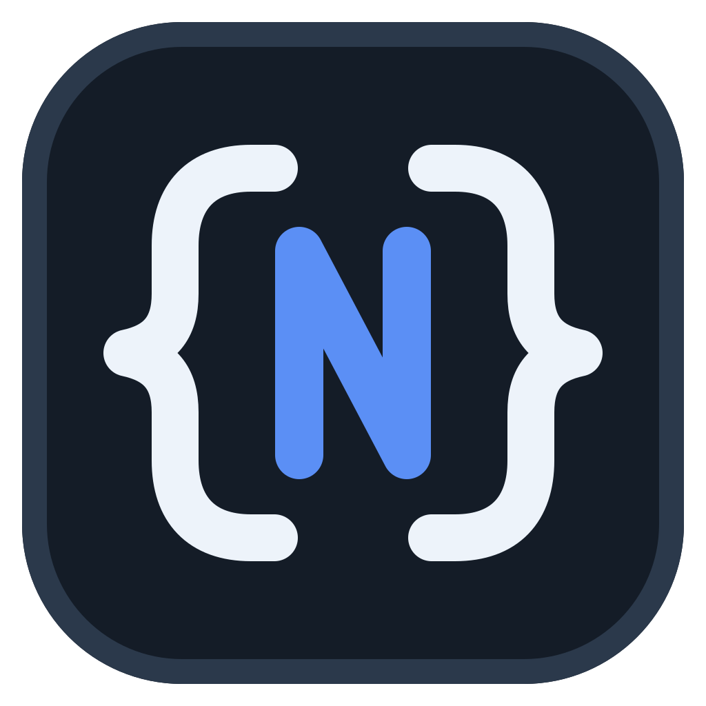
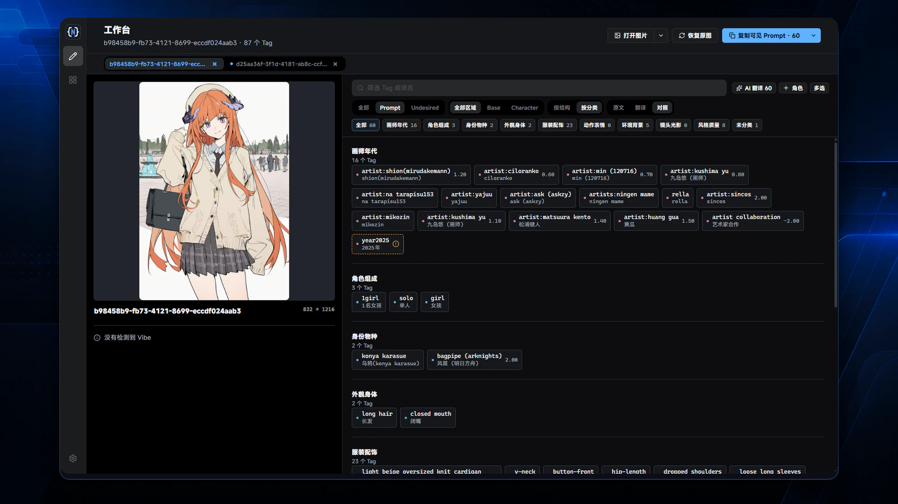
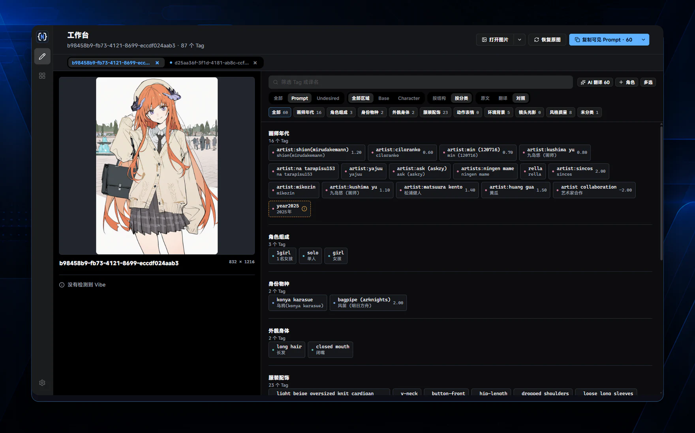
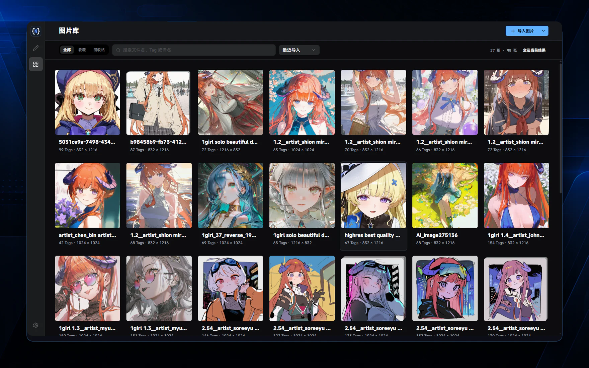
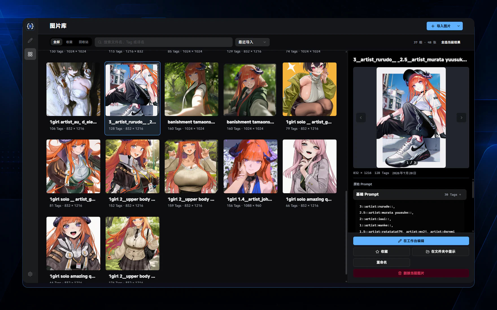
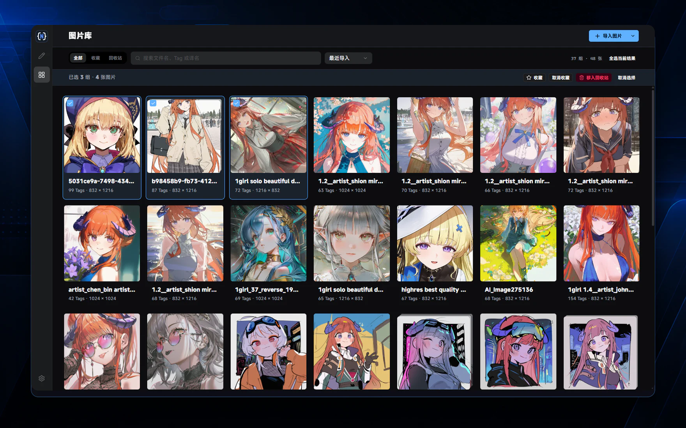
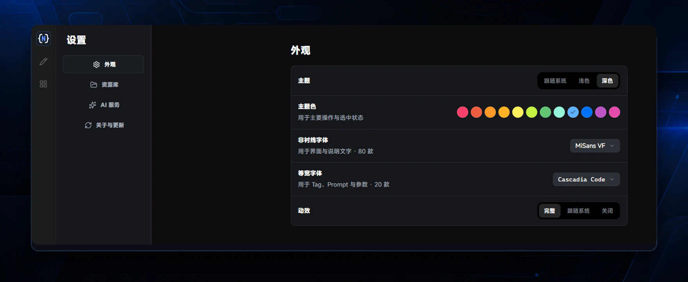
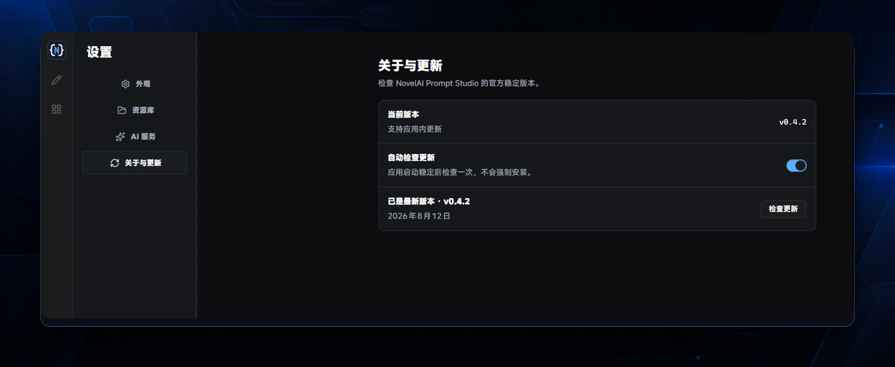

<div align="center">
  

  <h1>NovelAI Prompt Studio</h1>

  <p><strong>把藏在 NovelAI 图片里的 Prompt，变成清晰、可编辑、可复用的创作资产。</strong></p>
  <p>面向 NovelAI Diffusion V4 / V4.5 的本地 Prompt 工作台与图片库。</p>

  <p>
    <a href="https://github.com/LBEILC/NovelAIPromptStudio/releases/latest"></a>
    <a href="https://github.com/LBEILC/NovelAIPromptStudio/actions/workflows/release.yml"></a>
    
    
  </p>

  <p>
    <a href="https://github.com/LBEILC/NovelAIPromptStudio/releases/latest"><strong>下载最新版</strong></a>
    ·
    <a href="#工作台">工作台</a>
    ·
    <a href="#图片库">图片库</a>
    ·
    <a href="#快速开始">快速开始</a>
  </p>
</div>



## 从一张图片开始，而不是从一整段文本开始

把 NovelAI 图片拖进应用，Prompt Studio 会读取其中的生成信息，并将 Base Prompt、Character Prompt 与 Undesired Content 拆解为可视化 Tag。你可以搜索、翻译、分类、排序、调整权重，再按需要复制回 NovelAI。

| 读取 | 整理 | 复用 |
| --- | --- | --- |
| 从图片 metadata 恢复 Prompt 结构 | 按作用域、分类和语言查看 Tag | 复制可见、全部、Base 或 Character Prompt |
| 支持文件、拖放和剪贴板 | 编辑原始文本、权重与顺序 | 将值得保留的图片收入本地图片库 |
| 识别 V4 / V4.5 与内嵌 Vibe | 可选的 AI 翻译与分类 | 不改写原图，不锁定你的工作流 |

## 工作台



- **结构化 Prompt**：完整保留 Tag 顺序、权重、作用域和可识别的原始语法。
- **多标签编辑**：同时处理多张图片；每个标签拥有独立草稿、来源和修改状态，重启后继续工作。
- **灵活浏览**：在 Prompt / Undesired、Base / Character、按结构 / 按分类以及原文 / 翻译 / 对照之间切换。
- **快速整理**：搜索、拖拽排序、多选、批量添加与删除，并对异常 Prompt 语法给出提示。
- **精确复制**：主按钮复制当前筛选后可见的正向 Prompt；菜单可复制全部、完整 Base 或指定 Character Prompt。
- **AI 辅助**：连接你自己的 OpenAI-compatible 服务翻译和分类 Tag，结果缓存在本地并允许手动修正。
- **Vibe 恢复**：只读识别图片内嵌 Vibe，并按需导出 `.naiv4vibe` 文件。

工作台只读取源图片并保存本地草稿：不会自动加入图片库，也不会覆盖图片或改写 metadata。

## 图片库



把散落的生成结果整理成真正可回访的本地图库：

- 导入 `PNG`、`JPG`、`JPEG`、`WEBP` 或 NovelAI 导出 `ZIP`，支持多选、拖放和剪贴板。
- 按文件名、Tag 或译名搜索，并按最近或最早导入排序。
- 根据图片内容识别重复项，避免反复保存同一张图片。
- 收藏与重命名图片，在详情栏查看尺寸、日期和完整 Prompt。
- 从图库直接送入工作台，或在系统文件夹中定位资源。
- 大图预览支持缩放、旋转、翻转和复制；下载原图时保留格式与 NovelAI metadata。

### 同 Prompt 图片自动成组



完整 Prompt 相同、仅 Seed 等结果属性不同的图片会折叠为一组。你仍可以逐张浏览、选择头图和操作当前图片，而图库不会被大量相似卡片淹没。

### 批量整理，也能放心撤回



支持 `Ctrl/Cmd` 增减选择、`Shift` 范围选择和全选当前结果。可批量收藏、取消收藏或移入回收站；普通删除不会立刻清理文件，恢复、永久删除与清空回收站都有明确的作用范围和确认提示。

## 为桌面创作流程打磨

<table>
  <tr>
    <td width="50%"></td>
    <td width="50%"></td>
  </tr>
  <tr>
    <td align="center"><strong>让界面适应你的桌面</strong></td>
    <td align="center"><strong>保持在稳定版本</strong></td>
  </tr>
</table>

- 跟随系统、浅色和深色主题，12 种主题色。
- 分别选择界面非衬线字体与 Prompt 等宽字体，并控制动效偏好。
- 记住最近使用的图片目录，可迁移图片库资源位置。
- Windows 支持应用内检查、下载和安装更新；未签名 macOS 构建会检查版本并引导至官方 Release。
- `v0.4` 系列进一步优化了大图居中、图库详情侧栏、原始 Prompt 操作、Tag 拖拽动画与更新说明展示。

## 本地优先

图片、Prompt 草稿、Tag 字典和设置默认保存在本机。只有在你主动使用 AI 翻译或分类时，相关 Tag 文本才会发送到所配置的 OpenAI-compatible API。

- API Key 由 Electron 主进程通过操作系统安全存储加密，渲染页面无法读取明文。
- 工作台不复制源图；图片库只保存主动导入的独立副本和缩略图。
- 从图片库移除内容不会删除最初导入的外部源文件。
- 应用不生成图片，也不是 NovelAI 官方客户端；它专注于整理生成结果与 Prompt。

## 快速开始

1. 前往 [Releases](https://github.com/LBEILC/NovelAIPromptStudio/releases/latest) 下载适合系统的安装包。
2. 启动应用，将一张 NovelAI 图片拖入工作台。
3. 筛选、翻译、分类或调整 Tag，然后点击 **复制可见 Prompt**。

| 平台 | 安装包 |
| --- | --- |
| Windows x64 | `NovelAI-Prompt-Studio-Setup-*-x64.exe` |
| macOS Apple Silicon | `NovelAI-Prompt-Studio-*-arm64.dmg` |
| macOS Intel | `NovelAI-Prompt-Studio-*-x64.dmg` |

> [!NOTE]
> 当前安装包尚未进行代码签名，Windows 或 macOS 可能显示安全提示。请只从本仓库的 Releases 页面下载。

没有可识别 NovelAI metadata 的图片仍可查看和收藏，但无法自动恢复完整 Prompt。应用主要面向 NovelAI Diffusion V4 / V4.5 图片。

## 常用快捷键

| 快捷键 | 工作台 | 图片库 |
| --- | --- | --- |
| `Ctrl/Cmd + I` | 打开图片 | 导入图片 |
| `Ctrl/Cmd + V` | 从剪贴板打开图片 | 从剪贴板导入图片 |
| `Ctrl/Cmd + W` | 关闭当前标签 | — |
| `Ctrl/Cmd + Tab` | 下一个标签 | — |
| `Ctrl/Cmd + Shift + Tab` | 上一个标签 | — |
| `Ctrl/Cmd + K` | — | 聚焦搜索框 |

在文本输入区域中，`Ctrl/Cmd + V` 仍执行普通文本粘贴。

## 常见问题

<details>
<summary><strong>会修改我的原图吗？</strong></summary>

不会。工作台只读取源图并保存独立草稿；图片库保存的是应用管理副本。从图片库移除项目也不会删除最初导入的源文件。
</details>

<details>
<summary><strong>必须配置 AI 服务才能使用吗？</strong></summary>

不需要。Prompt 解析、筛选、编辑、复制和图片库均可离线使用。AI 服务只用于可选的 Tag 翻译与分类。
</details>

<details>
<summary><strong>为什么从剪贴板打开后没有 Prompt？</strong></summary>

应用会优先读取剪贴板中的原始图片数据以保留 metadata；但网页“复制图片”、截图工具和部分软件只提供像素，此时 NovelAI Prompt metadata 已经丢失。图片仍可正常打开或导入。
</details>

<details>
<summary><strong>数据保存在哪里？</strong></summary>

数据写入 Electron 的系统 `userData` 目录。数据库位于 `data/studio.sqlite`，图片库副本和缩略图位于 `assets/`。资源库位置可在设置中迁移。
</details>

<details>
<summary><strong>这是 NovelAI 官方应用吗？</strong></summary>

不是。本项目是面向 NovelAI 工作流的第三方工具，与 NovelAI 或 Anlatan 没有隶属或背书关系。
</details>

## 参与开发

需要 [Node.js 22](https://nodejs.org/) 及 npm。

```bash
git clone https://github.com/LBEILC/NovelAIPromptStudio.git
cd NovelAIPromptStudio
npm ci
npm run dev
```

```bash
npm test          # 运行测试
npm run build     # 构建前端
npm run package   # 生成当前平台安装包
```

提交改动前，请阅读[项目文档索引](./doc/README.md)与[协作约束](./AGENTS.md)。Windows 和 macOS 是一等支持平台；涉及窗口、快捷键、文件对话框、安全存储、安装或更新的改动需要在受影响的平台验证。

维护者发布新版本前请阅读[发版指南](./doc/release-guide.md)。欢迎通过 [Issues](https://github.com/LBEILC/NovelAIPromptStudio/issues) 反馈问题或提出建议。

---

<div align="center">
  <sub>让 Prompt 回到创作流程里，而不是困在 metadata 里。</sub>
</div>
