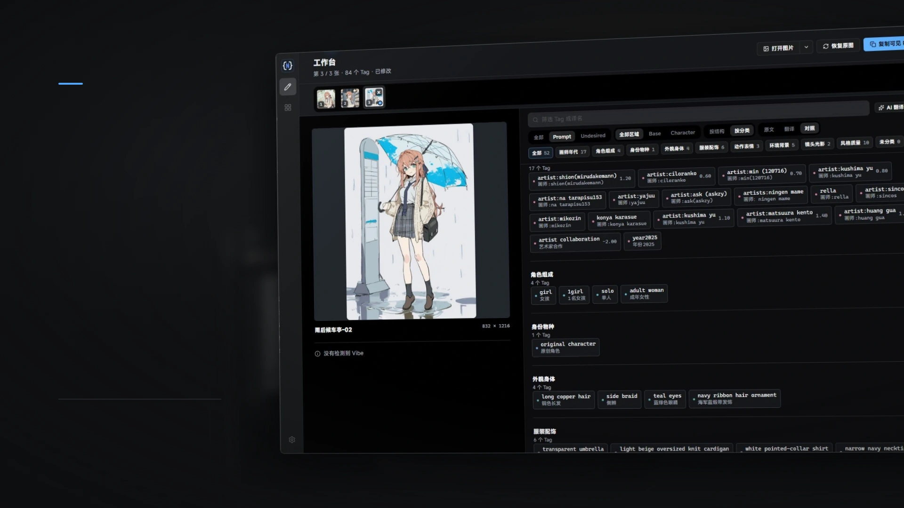
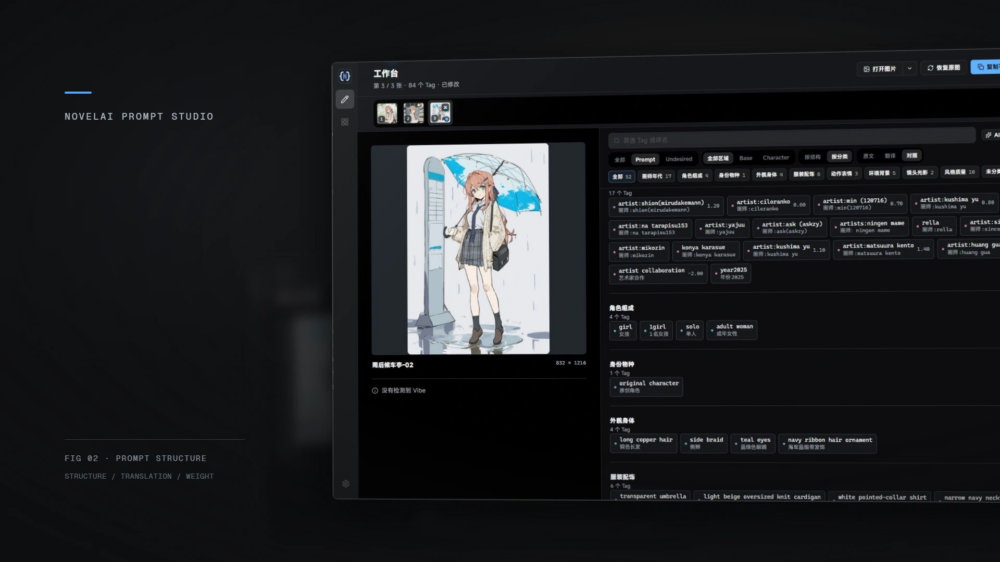
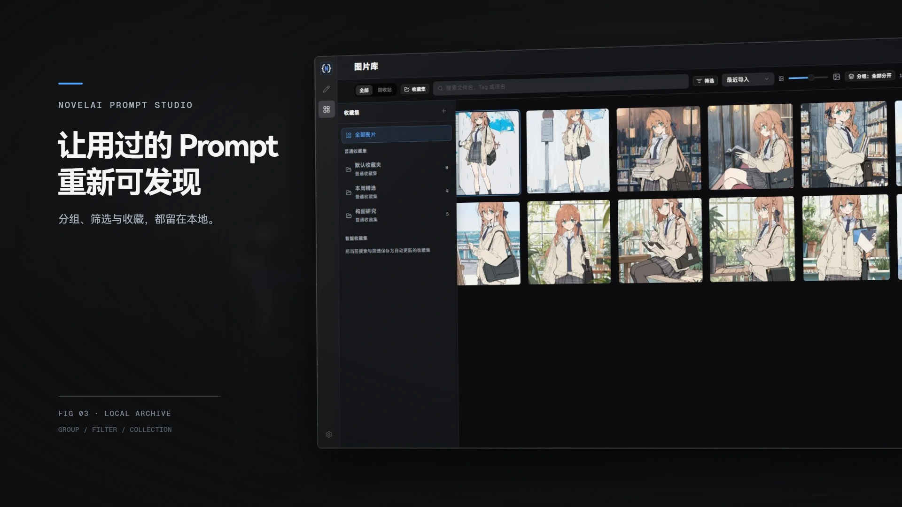

<div align="center">
  

  <h1>NovelAI Prompt Studio</h1>

  <p><strong>让 Prompt 回到创作流程。</strong></p>
  <p>从 NovelAI 图片中恢复、整理并复用 Prompt 的本地桌面工作台。</p>

  <p>
    <a href="https://github.com/LBEILC/NovelAIPromptStudio/releases/latest"><strong>下载最新版</strong></a>
    ·
    <a href="#从一张图片回到完整创作上下文">了解工作流</a>
    ·
    <a href="#快速开始">快速开始</a>
    ·
    <a href="#本地优先不是一句口号">数据与隐私</a>
  </p>
</div>



<p align="center">
  <a href="https://github.com/LBEILC/NovelAIPromptStudio/releases/latest"></a>
  <a href="https://github.com/LBEILC/NovelAIPromptStudio/actions/workflows/release.yml"></a>
  
  <a href="./LICENSE"></a>
</p>

## 从一张图片，回到完整创作上下文

一张生成图不只是最终结果。它还保存着当时使用的 Base Prompt、Character Prompt、Undesired Content、模型参数，以及可能内嵌的 Vibe。

NovelAI Prompt Studio 把这些信息从 metadata 里重新带回可读、可编辑的工作区：你可以看清 Prompt 的结构，整理真正属于自己的 Tag，再把需要的部分准确复制回下一次创作。

| 打开 | 整理 | 复用 |
| --- | --- | --- |
| 从文件、拖放或剪贴板打开图片 | 按作用域、分类和语言查看 Prompt | 复制可见、选中、Base 或 Character Prompt |
| 多张图片保留为独立工作标签 | 搜索、翻译、分类、排序与调整权重 | 保留原始顺序、权重、换行和特殊语法 |
| 识别 NovelAI V4、V4.5 与 V5 信息 | 区分用户内容与 NovelAI 自动 Prompt | 导出可恢复的 Vibe，或把图片收入本地图库 |

> NovelAI Prompt Studio 不生成图片，也不替代 NovelAI。它专注于图片生成之后、下一次创作之前的整理工作。

## 工作台：把 Prompt 看清楚



### 保留结构，而不是把 Prompt 压成一行文本

工作台会区分 Base、Character 与各自的 Undesired Content，并尽可能保留原始 Tag 顺序、权重、花括号、换行和作用域。对于 NovelAI V5，自然语言段落、引号中的逗号和多行 `Text:` 内容也会按原始文本保真复制。

角色 Prompt 可以单独查看、重命名、添加或移除；当前最多支持 22 个角色，同时继续兼容已导入图片中的原始角色信息。

### 只复制这一次真正需要的内容

你可以在 Prompt / Undesired、Base / Character、按结构 / 按分类以及原文 / 翻译 / 对照之间切换，并结合搜索、分类筛选和多选得到精确范围。

主按钮复制当前可见的正向 Prompt；菜单还可以复制全部、完整 Base、指定 Character 或包含自动 Tag 的原始 Prompt。译文不会混入生成用 Prompt，Undesired Content 也不会意外进入正向结果。

### 把 NovelAI 自动添加的内容与自己的创作区分开

对于可确认的 NovelAI V4.5 / V5 自动质量词和 UC 预设，工作台会标记来源并默认折叠。普通复制可以排除这些自动 Tag；需要完整复现时，仍可显式复制包含自动 Tag 的原始 Prompt。

如果内容与官方模板不完全匹配，应用不会擅自把它当作自动内容删除。

### 离线词典优先，AI 是可选的补全助手

应用内置由 [DanbooruSearchOnline（DSO）](https://github.com/SuzumiyaAkizuki/DanbooruSearchOnline) 固定版本转换而来的 52,475 条中文 Tag 译名，并使用其 93 个 Danbooru Tag Group 为常见外貌、服装、动作、环境、构图和风格 Tag 提供确定性分类。点击“翻译与分类”时会优先使用用户修正、Danbooru 画师验证、DSO 离线词典和本地规则；只有仍未完成且已经配置模型的 Tag 才交给 OpenAI-compatible 服务补全。

DSO 精确命中的翻译与分类不需要 AI 或网络。General Tag 并非都有可靠的 Tag Group，因此一部分内容仍会保留为“未分类”；DSO 未收录的名字可能继续通过 Danbooru 标签 API 验证是否为画师。所有结果都会缓存到本地并允许随时修正，用户修改始终具有最高优先级。内置数据版本、生成方式和原始许可证见[第三方数据说明](./third_party/DanbooruSearchOnline/README.md)。

每张打开的图片都拥有独立草稿、来源与修改状态。标签顺序、当前图片和工作状态会在重启后恢复，而源图片不会被覆盖或改写。

## 图片库：让用过的 Prompt 重新可发现



图库不是另一个生成器，而是一个面向回访与复用的本地创作档案：

- 导入 `PNG`、`JPG`、`JPEG`、`WEBP` 或 NovelAI 导出的 `ZIP`，支持多选、拖放和剪贴板。
- 按文件名、原始 Tag 或译名搜索，并结合包含 / 排除 Tag、模型、Vibe 与导入日期筛选。
- 根据图片内容跳过重复项；完整 Prompt 相同、仅 Seed 等结果属性不同的图片会自动折叠成组。
- 使用普通收藏集手动整理图片，或把当前搜索与筛选保存为会自动更新的智能收藏集。
- 支持框选、`Ctrl/Cmd` 增减选择、`Shift` 范围选择，以及批量收藏、加入收藏集和移入回收站。
- 在大图预览中缩放、旋转、翻转、复制或下载原图，并随时把当前图片送回工作台。

普通删除只会把应用管理副本移入回收站。恢复、永久删除与清空回收站都有明确的作用范围和确认步骤。

## 本地优先，不是一句口号

图片、工作台草稿、Tag 缓存、图库索引和设置默认保存在本机。应用不会要求账号，也不会把你的图库上传到远程服务。

| 操作 | 对源图片的影响 | 网络请求 |
| --- | --- | --- |
| 打开到工作台 | 只读，不复制、不改写 | 无 |
| 导入图片库 | 创建应用管理的独立副本 | 无 |
| 编辑、筛选或复制 Prompt | 只修改本地草稿 | 无 |
| DSO 词典翻译与本地分类 | 不修改源图 | 精确命中时无 |
| Danbooru 画师验证 | 不修改源图 | 仅查询 DSO 未收录的 Tag 名称 |
| AI 翻译与分类补全 | 不修改源图 | 仅发送离线方式仍未完成的 Tag 到你配置的 API |

- API Key 由 Electron 主进程通过操作系统安全存储加密，渲染页面无法读取明文。
- 从图片库移除内容不会删除最初导入的外部文件。
- 下载图片时保留应用持有的原始格式与 metadata。
- 图片库资源位置可以迁移；复制和校验完成前不会删除旧文件。

## 支持范围

| 类别 | 当前支持 |
| --- | --- |
| 操作系统 | Windows x64、macOS Apple Silicon、macOS Intel |
| NovelAI Prompt | Diffusion V4、V4.5、V5 |
| 工作台图片 | PNG、JPG / JPEG、WEBP |
| 图片库导入 | PNG、JPG / JPEG、WEBP、NovelAI ZIP |
| Metadata | NovelAI PNG 文本 metadata 与可识别的 Stealth PNG 信息 |
| Vibe | 只读识别与导出可恢复的 `.naiv4vibe`；不提供本地编辑或效果预览 |

JPG、WEBP、截图以及经过社交平台压缩的图片仍可打开和收藏，但如果 NovelAI metadata 已经丢失，就无法自动恢复完整 Prompt。

## 快速开始

1. 前往 [Releases](https://github.com/LBEILC/NovelAIPromptStudio/releases/latest)。
2. 下载适合当前系统的安装包并完成安装。
3. 启动应用，将一张 NovelAI 图片拖入工作台。
4. 筛选、翻译或整理 Tag，然后点击 **复制可见 Prompt**。

| 平台 | 安装包 |
| --- | --- |
| Windows x64 | `NovelAI-Prompt-Studio-Setup-*-x64.exe` |
| macOS Apple Silicon | `NovelAI-Prompt-Studio-*-arm64.dmg` |
| macOS Intel | `NovelAI-Prompt-Studio-*-x64.dmg` |

> [!NOTE]
> 当前安装包尚未进行代码签名，Windows 或 macOS 可能显示安全提示。请只从本仓库的 Releases 页面下载。

## 常用快捷键

| 快捷键 | 工作台 | 图片库 |
| --- | --- | --- |
| `Ctrl/Cmd + I` | 打开图片 | 导入图片 |
| `Ctrl/Cmd + V` | 从剪贴板打开图片 | 从剪贴板导入图片 |
| `Ctrl/Cmd + W` | 关闭当前标签 | — |
| `Ctrl/Cmd + Tab` | 下一个标签 | — |
| `Ctrl/Cmd + Shift + Tab` | 上一个标签 | — |
| `Ctrl/Cmd + K` | — | 聚焦搜索框 |

在文本输入区域中，`Ctrl/Cmd + V` 仍执行普通文本粘贴。

## 常见问题

<details>
<summary><strong>会修改我的原图吗？</strong></summary>

不会。工作台只读取源图并保存独立草稿；图片库保存的是应用管理副本。从图片库移除项目也不会删除最初导入的外部文件。
</details>

<details>
<summary><strong>必须配置 AI 服务才能使用吗？</strong></summary>

不需要。内置 DSO 中文词典和 Tag Group 分类可以离线处理已收录内容；AI 只用于补全仍缺少译文或可靠分类的 Tag。Prompt 解析、编辑、筛选、复制和图片库也都可以在不配置 AI 的情况下使用。
</details>

<details>
<summary><strong>为什么从剪贴板打开后没有 Prompt？</strong></summary>

应用会优先读取剪贴板中的原始图片数据以保留 metadata；但网页“复制图片”、截图工具和部分软件只提供重新编码后的像素，此时 NovelAI metadata 可能已经丢失。
</details>

<details>
<summary><strong>数据保存在哪里？</strong></summary>

数据写入 Electron 的系统 `userData` 目录。数据库默认位于 `data/studio.sqlite`，图片库副本与缩略图位于 `assets/`。资源库位置可以在设置中迁移。
</details>

<details>
<summary><strong>这是 NovelAI 官方应用吗？</strong></summary>

不是。本项目是面向 NovelAI 工作流的第三方工具，与 NovelAI 或 Anlatan 没有隶属或背书关系。
</details>

## 参与开发

需要 [Node.js 22](https://nodejs.org/) 及 npm。

```bash
git clone https://github.com/LBEILC/NovelAIPromptStudio.git
cd NovelAIPromptStudio
npm ci
npm run dev
```

```bash
npm test          # 运行测试
npm run build     # 构建前端
npm run package   # 生成当前平台安装包
```

提交改动前，请阅读[项目文档索引](./doc/README.md)与[协作约束](./AGENTS.md)。Windows 和 macOS 是一等支持平台；涉及窗口、快捷键、文件对话框、安全存储、安装或更新的改动需要在受影响的平台验证。

维护者发布新版本前请阅读[发版指南](./doc/release-guide.md)。欢迎通过 [Issues](https://github.com/LBEILC/NovelAIPromptStudio/issues) 反馈问题或提出建议。

## 许可证

当前开发分支及 `v0.9.2` 之后发布的版本采用 [GNU GPLv3](./LICENSE)（`GPL-3.0-only`）。你可以使用、研究、修改和再分发本项目；分发修改版本或安装包时，需要同时按 GPLv3 提供对应源代码并保留许可证声明。

`v0.9.2` 及更早的已发布版本继续适用原 Apache License 2.0。完整的授权边界与历史说明见 [`LICENSES/README.md`](./LICENSES/README.md)。用户导入的图片、Prompt 与其他个人数据不因使用本应用而改用 GPLv3。

内置中文 Tag 数据来自 GPLv3 项目 [DanbooruSearchOnline](https://github.com/SuzumiyaAkizuki/DanbooruSearchOnline)，固定来源、原始数据、许可证与转换说明保存在 [`third_party/DanbooruSearchOnline`](./third_party/DanbooruSearchOnline/README.md)。

---

<div align="center">
  <sub>一张图片，是一次创作留下的完整线索。</sub>
</div>
